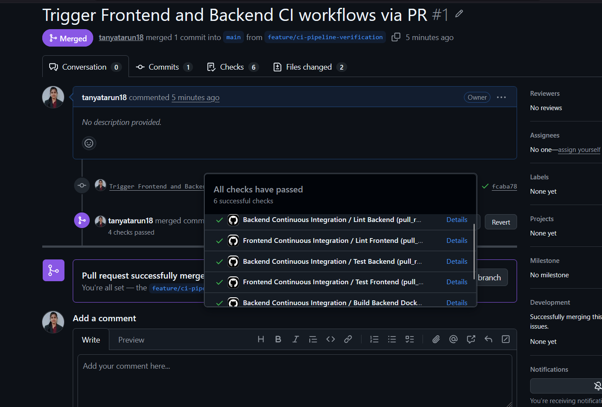
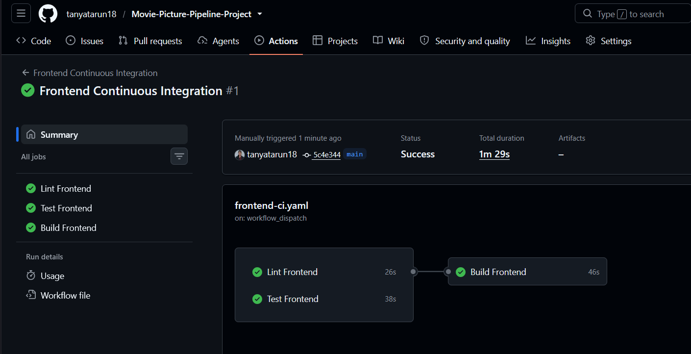
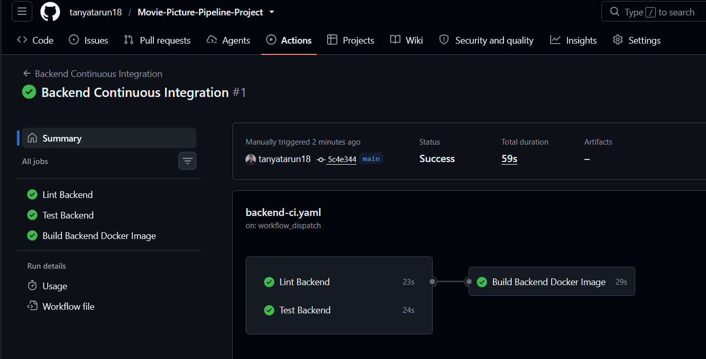
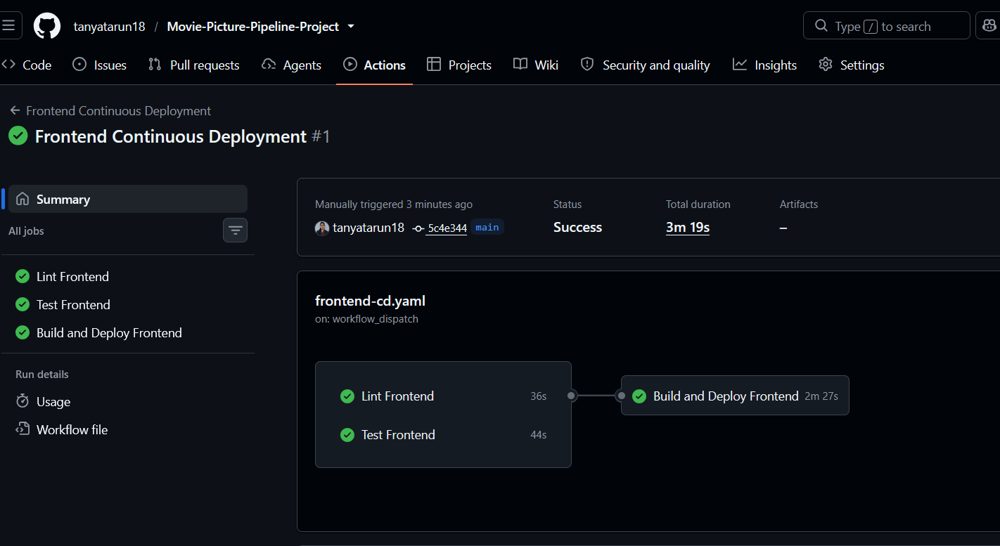
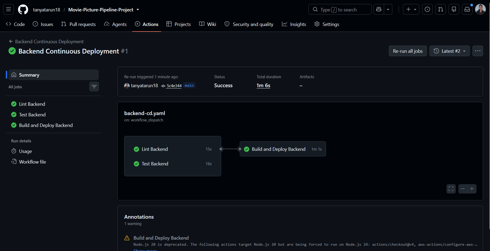
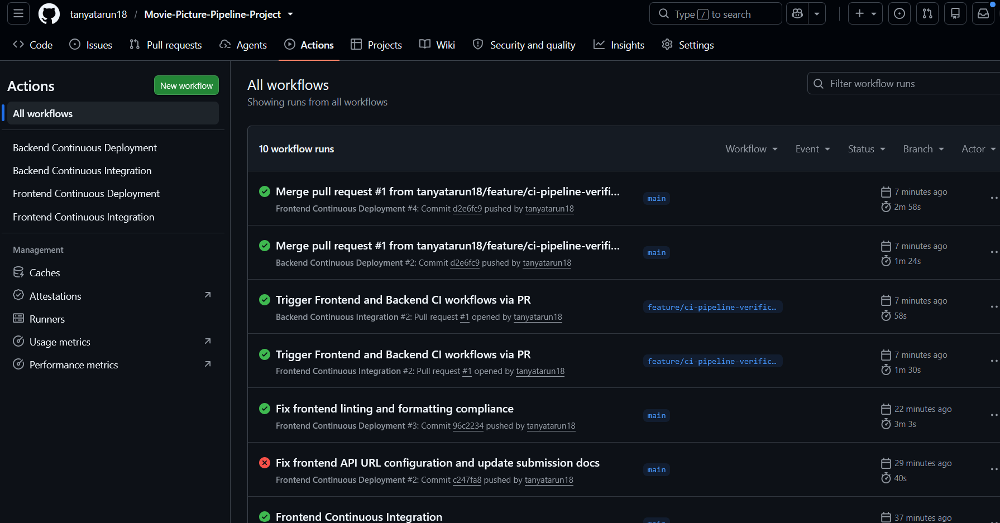
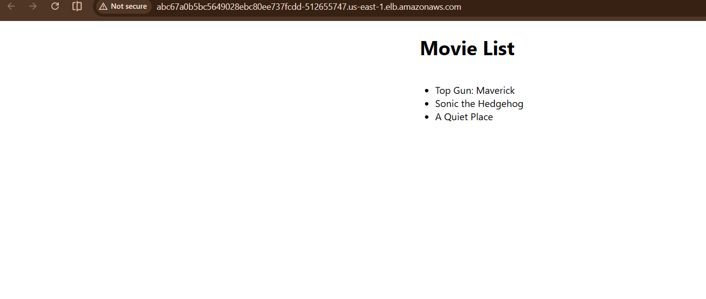
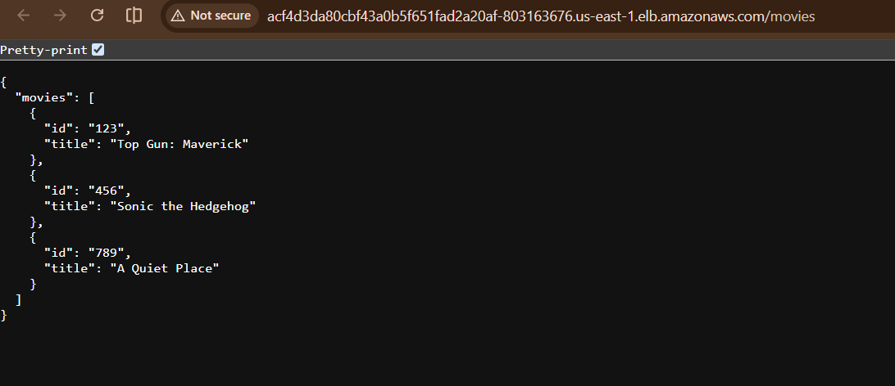

# Movie Picture Pipeline CI/CD Project Submission

**GitHub Repository Link:** [https://github.com/tanyatarun18/Movie-Picture-Pipeline-Project](https://github.com/tanyatarun18/Movie-Picture-Pipeline-Project)

## Live Deployment URLs

- **Frontend Application:** [http://abc67a0b5bc5649028ebc80ee737fcdd-512655747.us-east-1.elb.amazonaws.com/](http://abc67a0b5bc5649028ebc80ee737fcdd-512655747.us-east-1.elb.amazonaws.com/)
- **Backend API Endpoint:** [http://acf4d3da80cbf43a0b5f651fad2a20af-803163676.us-east-1.elb.amazonaws.com/movies](http://acf4d3da80cbf43a0b5f651fad2a20af-803163676.us-east-1.elb.amazonaws.com/movies)

## CI/CD Pipeline Verification

### 1. Continuous Integration (CI)
- Triggered automatically on Pull Requests targeting `main`.
- Runs parallel linting, unit testing, and Docker container build validation for both frontend and backend services.

### 2. Continuous Deployment (CD)
- Triggered on push to `main` when code changes within `starter/frontend/**` or `starter/backend/**`.
- Automatically builds tagged Docker images using git commit SHA, pushes to Amazon ECR, updates Kubernetes manifests using Kustomize, and applies rolling updates to Amazon EKS.

### 3. Application Verification
- Verified live communication between the React frontend and Flask backend services via AWS Load Balancers.

